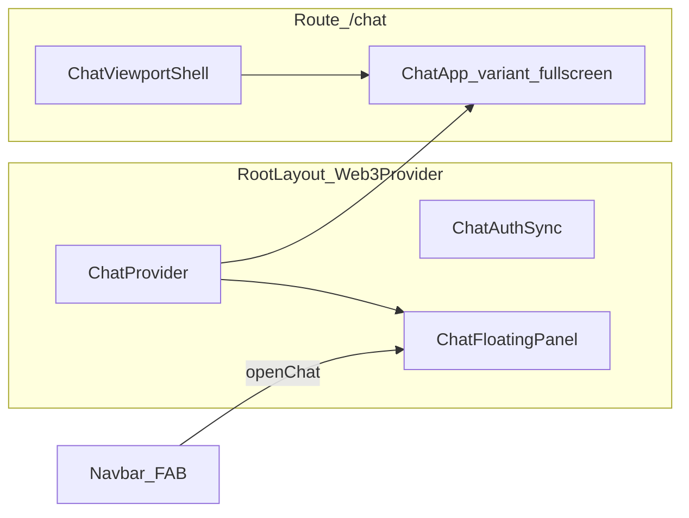

# 群聊：客服式浮层 + 产品与视觉规范

## 产品目标（本次一并纳入计划）

| 方向 | 说明 |
|------|------|
| 多语言 | **跟随系统/主站语言策略**：与全站 [`LocaleProvider`](frontend/components/locale-provider) 一致；**取消**当前 [`app/chat/page.tsx`](frontend/app/chat/page.tsx) 内进入聊天强制 `setLocale('zh')` 的行为。若主站尚未「跟系统」，可在本需求中明确：优先 `navigator.language` 初始化或与现有语言切换联动。 |
| 视觉 | **官方群等对话区**（气泡、正文字重/字号、圆角、留白、主色点缀）与现有 **官方客服卡片** 一致，以对齐品牌感知。基准参考：[`MobileOfficialSupportSheet`](frontend/components/mobile-official-support-sheet.tsx)（顶栏、消息区、输入区、按钮与链接样式）；聊天侧抽取共用 token 或子组件，避免两套割裂。 |
| 不做重复客服 | 站内 **已有** 导航栏「在线客服」弹层（同上组件 + [`chat-server` support API](chat-server)）。**聊天模块内不再做第二套「官方客服」入口或独立客服会话**，避免功能重复。 |
| 官方群 | 提供 **官方群**（可对应现有 `room-general` 或单独房间）：群内 **约 100 个机器人**（展示活跃/分区角色等由产品细化），在 [`chat-server` bot-service](chat-server/src/services/bot-service.ts) 与房间数据上扩展配置。 |
| 新建群组与列表规则 | 用户可 **新建群组**，分配 **群号码/群号**。**侧边列表展示规则（已澄清）**：除 **官方群**（全员可见、固定入口）外，用户 **只能看到本人创建过或加入过的群组**，**不展示**服务器上「当前所有群组」的公共目录。未加入的群 **不** 出现在列表中；他人通过 **搜索群号**（统一搜索能力）查找并 **加入** 后，该群才进入其「我的群组」列表。数据仍存服务端（成员关系），换设备登录同一账号列表一致。**非**「仅本地存储、不上服务器」。需 **chat-server** 房间模型 + API（创建、按码查找、加入、按用户过滤 `GET rooms`）+ 前端 `RoomList` 与搜索联动。 |
| 红包 | **发放与领取** 保持并纳入回归（已有 socket/HTTP 流程，浮层与全屏均需可用）。 |
| 搜索 | **统一搜索**：**群组**（含按群号）、**聊天记录**、**用户**；需要后端查询能力（索引或 DB 查询 + 权限）与前端统一搜索入口（建议顶栏或侧栏搜索图标，结果分 Tab 或分组）。 |
| 用户头像 | 默认头像由 [DiceBear](https://www.dicebear.com/)（建议 **adventurer** 人物风）。**地址锚定身份** + **同一自然日内不变、跨天更新** 仅 **发型、肤色、表情等** 易变维；`visitSalt` **已定**：`地址 + YYYY-MM-DD`（日历日建议用 **用户本地时区**，实现时写死一种规则并文档化）。服务端已有 `avatar` URL 仍优先。 |

## DiceBear 实现方式（调研结论）

官方能力见 [DiceBear 文档](https://www.dicebear.com/)：**同一 `seed` + 同一组选项 → 输出始终相同**。若只传 `seed=地址`，则整张头像固定，**无法实现**「按日轮换发型/肤色/表情」。

### 混合稳定 / 易变参数（满足「地址固定 + 每天变一次局部特征」）

**可以实现**，做法是 **不要**单靠一个 `seed` 扛所有随机性，而用 **显式选项**（[adventurer 选项](https://www.dicebear.com/styles/adventurer) 如 `hair`、`hairColor`、`skinColor`、`mouth`、`eyes`、`eyebrows` 等）：

1. **稳定维（仅由地址派生）**  
   用 `keccak256(地址)`（或 SHA-256）取若干字节，在 **允许枚举** 上映射到固定选项，例如长期固定：`eyes`、`hair` 大类、脸型相关 `features` 等，保证 **同一地址永远是同一张「脸骨架」**，他人可辨认。

2. **易变维（按自然日变化，每天最多一套）**  
   对 `hash(地址 + ":" + YYYY-MM-DD)` 取模映射到易变选项，例如 **`skinColor`、`hairColor`、`mouth`、部分 `hair` 细分**（与稳定维不冲突的字段由实现清单列出）。  
   - **已选 PRD**：`YYYY-MM-DD` 为 **日历自然日**（推荐按 **用户本地时区** 格式化日期字符串，使「换日」与用户感知一致；若全站统一用 UTC 也可，须在代码注释中固定）。同一天内任意次打开聊天，易变维 **相同**；过午夜后 **更新**。

3. **实现载体**  
   - **推荐 `@dicebear/core` + `@dicebear/adventurer`**：在客户端 `createAvatar(adventurer, { seed: address, ...explicitOptions })`，其中 `explicitOptions` 由上述两段 hash 填好（选项值须来自官方 schema 允许值，避免非法组合）。  
   - HTTP API 也可拼长 URL 传多参数，但国内可用性弱 + URL 长，仍建议 npm 方案。

4. **注意**  
   - 「人物感」一致依赖 **哪些字段划为稳定、哪些划为易变** 的划分，要在 UI 上试几轮避免「换次会话像换个人」。  
   - Guest 用户用稳定 guest id 同样规则即可。

**方案 A — HTTP API（实现最快）**

- URL 形态：`https://api.dicebear.com/9.x/{style}/svg?seed={encodeURIComponent(seed)}`（可加 `size` 等 [API 参数](https://www.dicebear.com/how-to-use/http-api)）。
- 优点：零打包体积、`` 直接用。
- 注意：请求发往 **境外** `api.dicebear.com` / CDN。**不挂 VPN 时**，在国内或跨境链路不稳环境下可能出现 **慢、超时、间歇无法加载**，与你们站内 WalletConnect 类似——**无法保证无 VPN 必可用**。务必：`img onError` 回退到首字母/渐变；若产品要求「无 VPN 也要稳定出图」，**不要以纯 API 为唯一路径**。
- 进阶（仍用 URL 但可控）：自建反向代理到 DiceBear 或把 SVG **落盘到自己 CDN**（首访生成缓存），运维成本更高。

**方案 B — npm `@dicebear/core` + 样式包（更可控）**

- 安装如 `@dicebear/core` + `@dicebear/avataaars`（或 `micah`、`bottts` 等 [样式列表](https://www.dicebear.com/styles)），在客户端 `createAvatar(style, { seed })` 得到 SVG 字符串或 Data URL。
- 优点：**不依赖运行时访问 dicebear 域名**（构建后随 JS 下发），**无 VPN 场景下比方案 A 稳**；隐私数据不经过第三方头像 API。
- 注意：增加 bundle 体积，需选定 **1～2 种风格**（真人向与机器人可向产品定）。

**对本站建议**：目标用户常处国内/弱国际链路时，**默认采用方案 B**；若坚持用方案 A，须接受「无 VPN 可能大量回退到首字母」或另做代理/缓存。

**与现有代码衔接**

- [`UserAvatar`](frontend/components/chat/UserBadge.tsx) 当前逻辑：`user.avatar` 为 `http(s)` 或 `/` 路径则用图，否则显示首字母/机器人标记。
- 建议新增 `lib/chat-dicebear-avatar.ts`：`getChatAvatarSvg(user, dateKey?: string): string | null` — 默认 `dateKey` 为当日 `YYYY-MM-DD`（本地或 UTC，与上一致）；有服务端 `avatar` 则返回之；否则用 **混合稳定/易变** 规则生成 adventurer SVG（或 data URL）。组件内可按日 `useMemo` 避免同屏重复计算。
- 同步检查 [`RoomList`](frontend/components/chat/RoomList.tsx)、[`ChatMembersModal`](frontend/components/chat/ChatMembersModal.tsx) 等直接使用 `u.avatar` 的分支，统一走同一 helper，避免列表与气泡不一致。

**机器人**

- 现有机器人可用 `/chat-bot-icons/*.svg`（[`UserAvatar` 注释](frontend/components/chat/UserBadge.tsx)）；若百 Bot 全用 DiceBear，可用 `seed=botUserId` 固定风格（如 `bottts`）与真人区分。

## 现状摘要

- 聊天逻辑在 [`frontend/app/chat/page.tsx`](frontend/app/chat/page.tsx)：`ChatProvider` 包一层，`ChatApp` 内包含登录门页 + 主界面（`RoomList` / `ChatRoom` / 红包侧栏等）。
- 全屏视口与键盘由 [`frontend/components/chat/chat-viewport-shell.tsx`](frontend/components/chat/chat-viewport-shell.tsx) 处理，仅在 [`frontend/app/chat/layout.tsx`](frontend/app/chat/layout.tsx) 使用。
- 全站 [`ChatAuthSync`](frontend/components/providers/chat-auth-sync.tsx) 已在 [`web3-provider.tsx`](frontend/components/providers/web3-provider.tsx) 挂载，签名预取不依赖是否打开 `/chat`。
- 导航入口在 [`frontend/components/navbar.tsx`](frontend/components/navbar.tsx) 链到 `/chat`。

## 推荐形态（产品/交互）

- **桌面**：右下角固定「气泡/FAB」，点击后弹出带圆角、阴影的卡片（宽约 `min(420px, 100vw-24px)`，高约 `min(640px, 85dvh)`），顶栏含标题与关闭；背后半透明遮罩，点遮罩关闭（与 [`RwaConnectWalletModal`](frontend/components/rwa-connect-wallet-modal.tsx) 的层次思路一致，注意 `z-index` 与连接钱包弹窗的叠放顺序，例如聊天 `z-[200]`、钱包保持 `z-[220]`）。
- **手机**：底部大抽屉（`rounded-t-2xl` + `max-h-[90dvh]`），行为接近客服 App，避免小窗可读性差。
- **保留 `/chat`**：继续提供全屏体验（书签、分享、若 PWA/manifest 指向聊天仍可用）；与弹窗共用同一套 `ChatProvider` 状态，避免两套会话。

## 功能完整性（必须保留）

弹层只是**外壳**（FAB、遮罩、尺寸、顶栏关闭），**不**做「精简版聊天」。`widget` 与 `fullscreen` 共用同一份业务树，确保与当前 [`app/chat/page.tsx`](frontend/app/chat/page.tsx) 行为一致，包括但不限于：

- **发红包 / 红包钱包**：`RedWalletPanel`、移动端抽屉、桌面侧栏、`RedPacketModal` 等现有交互与路由逻辑不变。
- **私聊（DM）**：`RoomList` / `ChatRoom` 内房间切换、私聊会话与消息流与全屏模式相同。
- **其它已有机能**：成员列表（`ChatMembersModal`）、表情（`EmojiPickerModal`）、快捷链接（`QuickLinksModal`）、机器人/Bot 面板（`BotPanel`）、Toast、管理员入口链接等，均在浮层内可访问；若某弹窗 `z-index` 被浮层遮挡，只调整层级而非砍功能。
- **实现原则**：抽取时移动的是「布局壳 + 顶栏差异」，**不要**为 `variant==='widget'` 写第二套 `ChatRoom` 或禁用子功能；懒加载若采用 `dynamic`，需保证子组件仍能拿到同一 `useChat()` 上下文。

## 分阶段建议

- **阶段 A（壳体）**：`ChatProvider` 上提、浮层 + `/chat` 全屏、导航入口、功能回归（含红包/私聊等现有能力）。  
- **阶段 B（体验统一）**：聊天页 i18n 修正 + 官方群消息区与 `MobileOfficialSupportSheet` 视觉对齐。  
- **阶段 C（数据与发现）**：群号、我的群列表与搜索入群、官方群百 Bot 配置。  
- **阶段 D（搜索）**：群/消息/用户统一搜索的后端与 UI。

阶段可并行，但 **D 依赖 C 的房间与用户模型稳定**。

## 实现要点（技术 — 浮层壳体）

1. **上提 `ChatProvider`**  
   - 从 `chat/page.tsx` 移到 [`web3-provider.tsx`](frontend/components/providers/web3-provider.tsx)（或单独 `chat-shell-provider.tsx` 再由 web3 引入），保证全站单例。  
   - `chat/page.tsx` 去掉外层 `ChatProvider`，仅保留 `ChatErrorBoundary` + `ChatApp`。

2. **抽取可复用壳体**  
   - 将 `ChatApp` 抽到例如 [`frontend/components/chat/chat-app-shell.tsx`](frontend/components/chat/chat-app-shell.tsx)，增加 props：  
     - `variant: 'fullscreen' | 'widget'`  
     - `onRequestClose?: () => void`（widget 顶栏关闭）  
   - **fullscreen**：保留现有顶栏「回首页」`Link href="/"`、现有侧栏/红包逻辑。  
   - **widget**：仅调整顶栏（关闭、可选「全屏打开」链到 `/chat`）；**以下整块与全屏相同**：`RoomList`、`ChatRoom`、红包侧栏/抽屉、以及各 `*Modal` 触发方式。  
   - 登录门页在 widget 内可略压缩边距，但尽量复用同一 JSX，减少分叉。

3. **新增 `ChatFloatingPanel`（客服浮层）**  
   - 新文件建议 [`frontend/components/chat/chat-floating-panel.tsx`](frontend/components/chat/chat-floating-panel.tsx) + 小 context [`frontend/components/providers/chat-panel-context.tsx`](frontend/components/providers/chat-panel-context.tsx)：`openChatPanel` / `closeChatPanel` / `toggle`。  
   - 在 `web3-provider` 中于 `ChatProvider` 内渲染：`FAB` +（`open` 时）遮罩 + 面板，内嵌 `ChatApp variant="widget"`。  
   - **首开懒加载**：用 `next/dynamic` 懒加载面板内容或整个 `ChatApp` 子树，减轻非聊天页的首包（可选但推荐）。

4. **视口与键盘（widget）**  
   - 浮层内先用 **`h-[min(85dvh,720px)]` + `flex min-h-0` + `overflow-hidden`** 复刻当前聊天区的 flex 约束；若 iOS 输入框被挡，再迭代：或在小屏 widget 内也包一层简化版 `visualViewport` 逻辑（第二迭代，避免第一版范围过大）。  
   - **不要**在根布局对 `document.body` 长期 `overflow:hidden`（当前仅 `/chat` 页在 `ChatApp` 里做了）；仅在 `open && widget` 时可按需锁滚动（与连接钱包弹窗一致）。

5. **导航改造**  
   - [`navbar.tsx`](frontend/components/navbar.tsx) 桌面/移动菜单中「群聊」：`preventDefault` + `openChatPanel()`；可保留中键/Cmd+点击仍打开 `/chat` 新标签（可选）。  
   - 若需直达全屏：保留原 `/chat` 链接或增加「在独立页面打开」二级入口（按产品决定）。

6. **`/chat` 路由**  
   - `layout` 继续用 `ChatViewportShell` 包 `children`。  
   - `page` 渲染 `ChatApp variant="fullscreen"`，确保与浮层共享 `ChatProvider` 后，从浮层进入全屏或反过来状态连续。

7. **边界**  
   - `/chat/admin` 仍独立页，不必放进浮层。  
   - 浮层与 `RwaConnectWalletModal` 同时打开时的交互：通常钱包优先；聊天打开时点击「连接钱包」可关闭聊天或保持叠放（建议关闭聊天或减少 z-index 冲突）。

## 实现要点（技术 — 多语言）

- 删除或条件化 `ChatApp` 内「进入聊天默认中文」的 `useEffect`（[`page.tsx` 约 64–70 行](frontend/app/chat/page.tsx)），改为依赖全局 `locale`。  
- 聊天 copy 一律走 `t('chat.*')` / 主站 `i18n`，与客服卡片共用语言状态，避免中英分裂。

## 实现要点（技术 — 视觉与官方群）

- 从 `MobileOfficialSupportSheet` 提炼 **可复用样式常量**（如圆角、背景、边框、`font-mono`/`heading` 使用规则）或小型展示组件，供 `MessageBubble` / 官方群系统消息条使用。  
- **不在聊天内** 新增「联系官方客服」主流程；若需帮助链接，可与客服弹层相同的 `/help`、外链一致即可。

## 实现要点（技术 — 群号 / 我的群 / 搜索）

- **chat-server**  
  - 扩展 `room`：`inviteCode`（群号）、`isOfficial`（或等价标记）、`members` / 成员关系。  
  - **`GET /rooms`（或现有列表接口）**：返回 **官方群 ∪ 当前用户为成员的非官方群**；**不得**返回用户未加入的第三方群。  
  - **按群号查找**：独立接口（如 `GET /rooms/by-code/:code` 或搜索子路径），仅返回可加入的元信息 + 加入动作；加入成功后写入成员关系，再出现在该用户列表中。  
- **前端**：`RoomList` 仅渲染接口返回的上述集合；「新建群」后刷新列表；统一搜索里「搜群号」走查找接口并引导加入。  
- **聊天记录搜索**：仅搜索当前用户 **有权限** 的房间内消息（分页、高亮、跳转 `jumpToMessage` 已有可参考）。  
- **用户搜索**：按昵称/地址（以现有用户表结构为准）返回可发起 DM 等操作。

## 风险与验收

- **风险**：双处挂载过两个 `ChatProvider` 会导致状态分裂——上提后必须全仓只保留一处 Provider。  
- **已澄清（PRD）**：「只在自己客户端显示」= **列表过滤规则** — 官方群 + **我创建/我加入** 的群；**不是**全站群目录，**也不是**纯本地离线列表。实现上依赖 **服务端成员关系** 与按用户过滤的 rooms API，换设备同账号列表一致。  
- **验收（壳体）**：任意非 `/chat` 页打开浮层可登录/进房/发消息；关闭后返回原页面状态不变；`/chat` 全屏行为与现网一致；移动端键盘可接受。  
- **验收（语言）**：系统/主站切换语言后，聊天与客服卡片语言一致，无强制中文。  
- **验收（视觉）**：官方群对话样式与客服卡片目测一致（抽检暗色、间距、气泡）。  
- **验收（功能）**：官方群 Bot 规模达标；建群有群号、可搜索加入；红包收发；统一搜索三类结果可用。  
- **功能回归清单（浮层 + 全屏各测一遍）**：发红包与领红包、私聊切换与收发、群成员弹窗、表情发送、红包钱包面板开闭、Bot/快捷入口、Admin 链接（权限用户）。
