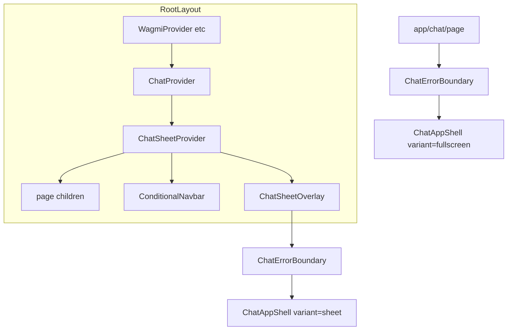

# 群聊：导航栏底部弹窗 + 全屏页并存

## 目标行为

- 全站（除 [`/chat` 路由](frontend/components/conditional-navbar.tsx) 外）导航栏 **群聊**：主键点击打开 **自底部滑入** 的全功能群聊面板（红包、私聊、成员、表情、Bot 等与现页一致，同一套 `useChat` 状态）。
- **中键 / Ctrl/Cmd+点击** 仍可 `href="/chat"` 新开标签全屏聊天。
- 已在 [`/chat`](frontend/app/chat/page.tsx) 时：菜单项行为保持 **进入全屏页**（与现有一致）。
- 抽屉内提供 **关闭** 与 **全屏打开**（`router.push('/chat')` 并关抽屉）。

## 架构

- **会话与 Socket**：[`ChatProvider`](frontend/components/chat/chat-context.tsx) 已在 mount 时根据本地持久化会话做 [`connectWithCredentials`](frontend/components/chat/chat-context.tsx)（约 907–954 行），上提到根布局后，已登录用户会在全站恢复聊天会话；与现有 [`ChatAuthSync`](frontend/components/providers/chat-auth-sync.tsx) 一致。
- **全屏视口**：[`ChatViewportShell`](frontend/components/chat/chat-viewport-shell.tsx) 仍在 [`app/chat/layout.tsx`](frontend/app/chat/layout.tsx) 中包裹全屏子树；**抽屉内不用** `ChatViewportShell`（避免在固定高度容器里再套一层 `visualViewport` fixed 逻辑），用 `flex` + `min-h-0` + 与 [`MobileOfficialSupportSheet`](frontend/components/mobile-official-support-sheet.tsx) 类似的 **锁定高度**（`innerHeight * 0.86` cap 720，打开时用 `requestAnimationFrame` 做 `translate-y` 动画）。

## 具体改动

### 1. 抽出错误边界

- 新建 [`frontend/components/chat/chat-error-boundary.tsx`](frontend/components/chat/chat-error-boundary.tsx)：从 [`app/chat/page.tsx`](frontend/app/chat/page.tsx) 迁出 `ChatErrorBoundary` 类（逻辑不变）。

### 2. 抽出 `ChatApp` → `ChatAppShell`

- 新建 [`frontend/components/chat/chat-app-shell.tsx`](frontend/components/chat/chat-app-shell.tsx)：
  - Props：`variant: 'fullscreen' | 'sheet'`；`onRequestClose?: () => void`；`onOpenFullPage?: () => void`。
  - **仅** `variant === 'fullscreen'` 时 `useEffect` 锁 `html/body overflow`（迁出现有 51–62 行逻辑）。
  - **删除**「进入聊天页默认中文」的 `useEffect`（现 64–70 行），与主站 [`LocaleProvider`](frontend/components/locale-provider.tsx) 一致。
  - 已登录顶部栏：fullscreen 左侧保留 [`Link href="/"`](frontend/app/chat/page.tsx)（约 381–388 行）；sheet 左侧改为 **关闭**（`onRequestClose`），并在右侧栏增加 **全屏** 文字按钮（`onOpenFullPage`）。
  - 其余登录页、主聊天区、`RoomList` / `ChatRoom` / `RedWalletPanel` 等 **原样迁入**，保证功能不减。

### 3. 抽屉 + Context

- 新建 [`frontend/components/providers/chat-sheet-context.tsx`](frontend/components/providers/chat-sheet-context.tsx)：
  - `useChatSheet()`：`openChatSheet`、`closeChatSheet`、`isChatSheetOpen`。
  - `ChatSheetProvider`：`open` 时 `body overflow: hidden`、`Escape` 关闭、与支持页一致的 **滑入动画 + 锁定高度**。
  - 叠层 z-index：建议 **155/156**（高于导航 110、官方客服 145/146，低于连接钱包 [`z-[220]`](frontend/components/rwa-connect-wallet-modal.tsx)）。
  - 面板样式：对齐支持抽屉（`bg-gradient`、`border-[#00f5d420]`、`rounded-t-3xl`、`shadow` 等，可从 support 组件抄关键 class）。
  - 内容：`<ChatErrorBoundary><ChatAppShell variant="sheet" … /></ChatErrorBoundary>`。

### 4. 根布局挂载 Provider

- 修改 [`frontend/app/layout.tsx`](frontend/app/layout.tsx)：在 `Web3Provider` 内用 `ChatProvider` → `ChatSheetProvider` 包裹 `{children}` 与 `ConditionalNavbar`（顺序保持「先页面、后导航栏」以符合 [`conditional-navbar` 注释](frontend/components/conditional-navbar.tsx) 的叠层意图；抽屉由 Provider 内额外节点渲染，始终在最上）。

### 5. 聊天页瘦身

- 修改 [`frontend/app/chat/page.tsx`](frontend/app/chat/page.tsx)：仅保留 `ChatErrorBoundary` + `<ChatAppShell variant="fullscreen" />`，**去掉** 内层 `ChatProvider` 与内联 `ChatApp` / `ChatErrorBoundary` 定义。

### 6. 导航栏接线

- 修改 [`frontend/components/navbar.tsx`](frontend/components/navbar.tsx)：
  - `import { useChatSheet } from '@/components/providers/chat-sheet-context'`。
  - **桌面** 群聊 [`Link`](frontend/components/navbar.tsx)（约 662–689 行）：改为带 `href="/chat"` 的 `<a>` 或保留 `Link`，`onClick` 中若 `pathname === '/chat'` 则沿用 `navigateFromMenuLink`；否则 `preventDefault` + `openChatSheet()` + `closeDesktopMenus()`；忽略非主键与 modifier 键以便新标签打开。
  - **移动端抽屉**（约 837–861 行）：同样规则，`pathname === '/chat'` 时 `router.push` + 关抽屉；否则 `openChatSheet()` + 关抽屉。

### 7. i18n

- 在 [`frontend/lib/i18n.ts`](frontend/lib/i18n.ts) 的 `base.chat` 与 `zh` 覆盖中增加少量键，例如：`openFullChat`（「Full page」/「全屏聊天」）、`closeChatPanelAria`（关闭抽屉 aria，可与现有 `wallet.close` 复用则省略）。

## 验证

- 非 `/chat` 页：点群聊 → 抽屉自底滑入，可登录、进房、发红包、私聊等；Esc / 点遮罩 / 顶栏关闭 → 关闭。
- `/chat` 全屏：布局仍为 `ChatViewportShell`，行为与改前一致（除不再强制中文）。
- 连接钱包弹窗与抽屉同时需要时：钱包层在 220，仍压在最上。

## 上线

- 按仓库规则在改动完成后执行：`bash /www/wwwroot/rwaprotocol.dpdns.org/frontend/deploy-frontend.sh`。
